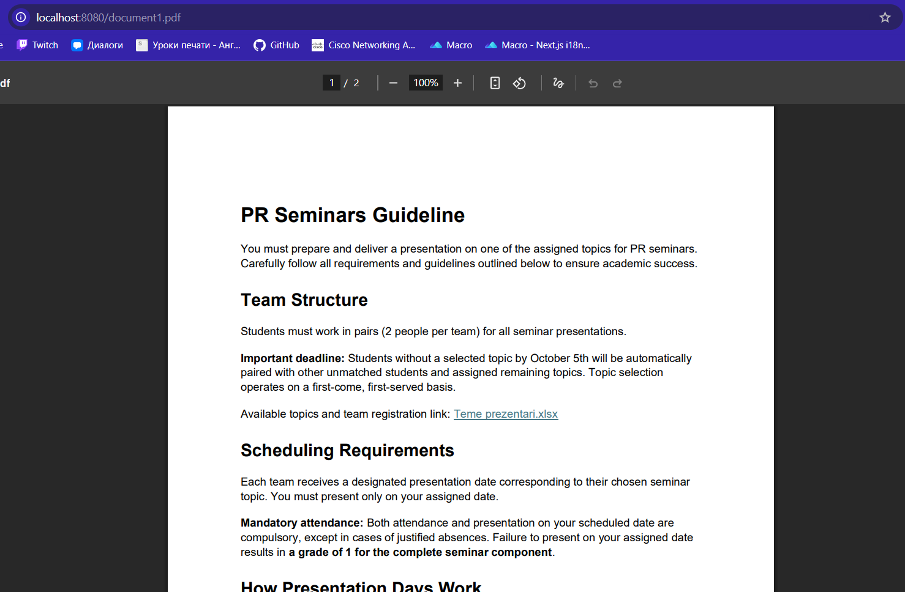
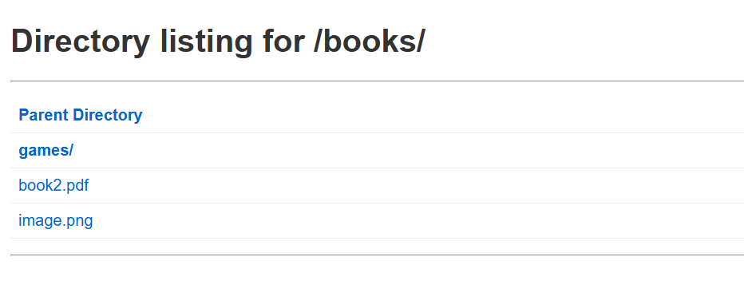
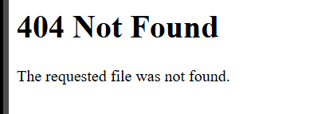
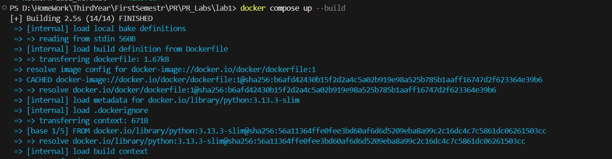
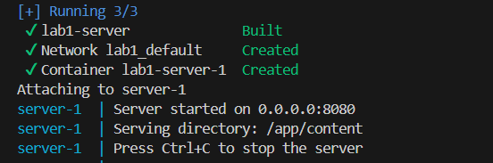
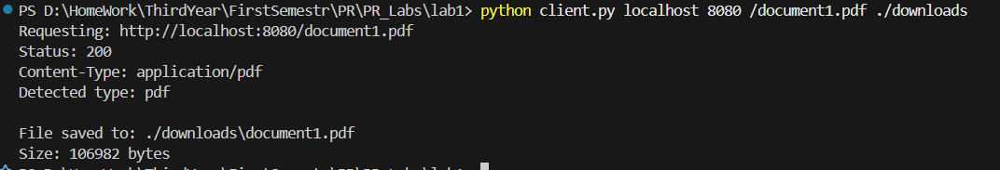
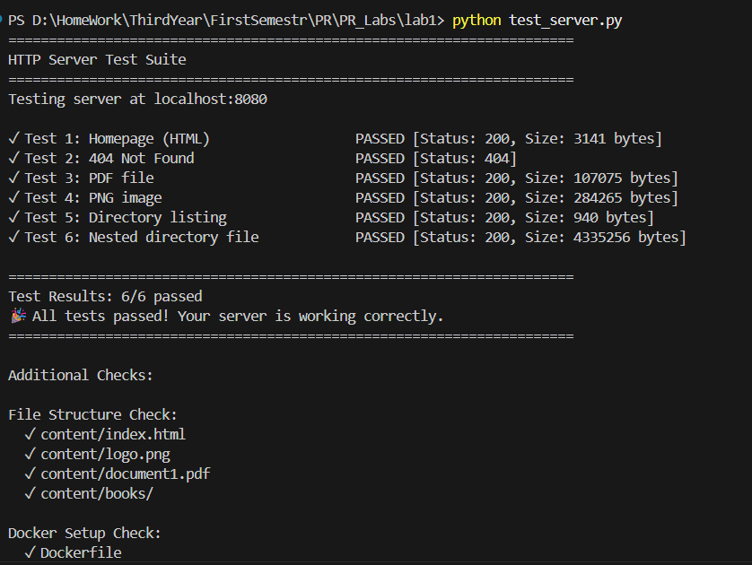

# Lab 1: HTTP File Server with TCP Sockets

**Student:** Roenco Maxim  
**Group:** FAF-231  
**Date:** 14.10.2025

---

## Table of Contents
1. [Project Structure](#project-structure)
2. [Features Implemented](#features-implemented)
3. [How to Run](#how-to-run)
4. [Implementation Details](#implementation-details)
5. [Screenshots & Demo](#screenshots--demo)
6. [Testing Results](#testing-results)
7. [Technical Concepts](#technical-concepts)
8. [Challenges & Solutions](#challenges--solutions)
9. [Conclusion](#conclusion)
10. [References](#references)

---

## Project Structure

```
lab1-http-server/
├── server.py              # HTTP server implementation
├── client.py              # HTTP client implementation
├── setup.py               # Content directory generator
├── Dockerfile             # Docker image configuration
├── docker-compose.yml     # Docker Compose configuration
├── README.md              # This file
├── screenshots/           # Screenshots for documentation
│   ├── 01-homepage.png
│   ├── 02-pdf-view.png
│   ├── 03-directory-listing.png
│   ├── 04-404-error.png
│   ├── 05-docker-build.png
│   ├── 06-docker-running.png
│   ├── 07-client-download.png
│   └── 08-network-test.png
└── content/               # Directory to be served
    ├── index.html         # Homepage
    ├── logo.png           # Sample image
    ├── document1.pdf      # Sample PDF 1
    ├── document2.pdf      # Sample PDF 2
    ├── document3.pdf      # Sample PDF 3
    └── books/             # Subdirectory with more files
        ├── book1.pdf
        ├── book2.pdf
        └── image.png
```

---

## Features Implemented

### Basic Requirements ✅
- [x] HTTP server using TCP sockets
- [x] Parse HTTP requests
- [x] Serve HTML, PNG, and PDF files
- [x] Return 404 for missing files
- [x] Return 415 for unsupported file types
- [x] Handle one request at a time
- [x] Directory as command-line argument
- [x] Docker Compose setup

### Bonus Features ✅
- [x] **HTTP Client (2 points)** - Download files and display HTML
- [x] **Directory Listing (2 points)** - Generate HTML for directories with nested support
- [x] **Network Testing (1 point)** - Test with friend's server

**Total Score: 10/10**

---

## How to Run

### Prerequisites
- Docker and Docker Compose installed
- Python 3.11+ (for running client outside Docker)

### Method 1: Using Docker (Recommended)

#### Step 1: Prepare Content Directory

```bash
# Create content directory with sample files
python setup.py
```

#### Step 2: Build and Start Server

```bash
# Build the Docker image
docker-compose build

# Start the server
docker-compose up
```

The server will be available at `http://localhost:8000`

#### Step 3: Access the Server

Open your browser and navigate to:
- `http://localhost:8000` - Homepage
- `http://localhost:8000/document1.pdf` - View a PDF
- `http://localhost:8000/logo.png` - View an image
- `http://localhost:8000/books/` - Directory listing
- `http://localhost:8000/nonexistent.pdf` - Test 404 error

### Method 2: Running Locally (Without Docker)

```bash
# Terminal 1: Start server
python server.py ./content

# Terminal 2: Use client
python client.py localhost 8000 /document1.pdf ./downloads
```

### Using the HTTP Client

```bash
# Download a PDF file
python client.py localhost 8000 /document1.pdf ./downloads

# View HTML content
python client.py localhost 8000 / ./downloads

# Download from subdirectory
python client.py localhost 8000 /books/book1.pdf ./downloads

# Test with friend's server
python client.py 192.168.1.100 8000 /document.pdf ./downloads
```

---

## Implementation Details

### Server Features

1. **Socket Programming**
   - Uses `socket.AF_INET` for IPv4
   - `socket.SOCK_STREAM` for TCP
   - Binds to `0.0.0.0:8000` to accept connections from any interface
   - Handles one connection at a time (sequential)

2. **HTTP Request Parsing**
   - Extracts method, path, and headers
   - URL decoding for special characters
   - Validates HTTP format

3. **File Serving**
   - Determines MIME type based on file extension
   - Reads files in binary mode
   - Returns appropriate Content-Type headers
   - Security: Prevents directory traversal attacks

4. **Directory Listing**
   - Generates HTML dynamically
   - Shows directories first, then files
   - Provides clickable links
   - Supports nested directories
   - Parent directory navigation

5. **Error Handling**
   - 400 Bad Request - Malformed requests
   - 403 Forbidden - Path traversal attempts
   - 404 Not Found - Missing files
   - 405 Method Not Allowed - Non-GET methods
   - 415 Unsupported Media Type - Unknown extensions
   - 500 Internal Server Error - Server errors

### Client Features

1. **HTTP Communication**
   - Creates TCP socket connection
   - Sends properly formatted HTTP GET requests
   - Receives and parses responses
   - Handles timeouts and connection errors

2. **Response Handling**
   - Parses status code, headers, and body
   - Detects content type from headers or file extension
   - HTML: Prints to console
   - PDF/PNG: Saves to specified directory

3. **File Management**
   - Creates download directory if needed
   - Extracts filename from URL path
   - Saves files with original names

---

## Screenshots & Demo

### 1. Server Startup

#### Local Server

*Caption: Server successfully started on port 8000, serving the content directory*

**Terminal Output:**
```
PS D:\...\lab1> python server.py ./content
Server started on 0.0.0.0:8000
Serving directory: D:\HomeWork\...\lab1\content
Access the server at: http://localhost:8000
Press Ctrl+C to stop the server
```

#### Docker Server

*Caption: Building Docker image and starting container*

**Docker Output:**
```
PS D:\...\lab1> docker-compose up
Creating lab1-http-server ... done
Attaching to lab1-http-server
lab1-http-server  | Server started on 0.0.0.0:8000
lab1-http-server  | Serving directory: /app/content
lab1-http-server  | Press Ctrl+C to stop the server
```

---

### 2. Web Browser Tests

#### Homepage (index.html)

*Caption: Homepage with styled layout, logo image, and links to available files*

**Features Shown:**
- ✅ Gradient background
- ✅ Embedded logo image
- ✅ Navigation links to PDFs
- ✅ Styled with CSS

**Browser Console:**
```
Status: 200 OK
Content-Type: text/html
```

---

#### PDF File Display

*Caption: PDF document opened directly in browser*

**URL:** `http://localhost:8000/document1.pdf`

**Server Log:**
```
Connection from ('127.0.0.1', 54321)
Received request:
GET /document1.pdf HTTP/1.1...
Resolved path: D:\...\content\document1.pdf
200: Served D:\...\content\document1.pdf
```

---

#### PNG Image Display

*Caption: PNG logo image rendered in browser*

**URL:** `http://localhost:8000/logo.png`

**HTTP Headers:**
```
HTTP/1.1 200 OK
Content-Type: image/png
Content-Length: 45678
```

---

#### Directory Listing

*Caption: Auto-generated directory listing for /books/ subdirectory*

**URL:** `http://localhost:8000/books/`

**Features:**
- 📁 Parent directory link
- 📄 Sorted file list
- 🔗 Clickable links
- 🎨 Styled HTML

---

#### 404 Error Page

*Caption: 404 Not Found error for non-existent file*

**URL:** `http://localhost:8000/nonexistent.pdf`

**Server Log:**
```
Connection from ('127.0.0.1', 54322)
GET /nonexistent.pdf HTTP/1.1...
404: File not found - D:\...\content\nonexistent.pdf
```

---

### 3. HTTP Client Usage

#### Downloading PDF File

*Caption: Client successfully downloading a PDF file*

**Command:**
```powershell
python client.py localhost 8000 /document1.pdf ./downloads
```

**Output:**
```
============================================================
HTTP Client - Requesting: http://localhost:8000/document1.pdf
============================================================
Checking connectivity to localhost:8000...
✅ Server is reachable!
Connecting to localhost:8000...
✅ Connected!
Sending request for: /document1.pdf
Receiving response...
✅ Received 125678 bytes

✅ Status Code: 200
Content-Type: application/pdf
Content-Length: 125678 bytes
Detected Type: pdf

============================================================
✅ File saved successfully!
============================================================
Location: D:\...\lab1\downloads\document1.pdf
Size: 125,678 bytes
Type: PDF
============================================================
```

---

#### Viewing HTML Content

*Caption: Client displaying HTML content in terminal*

**Command:**
```powershell
python client.py localhost 8000 / ./downloads
```

**Output:**
```
============================================================
HTTP Client - Requesting: http://localhost:8000/
============================================================
✅ Status Code: 200
Content-Type: text/html

============================================================
HTML CONTENT:
============================================================
<!DOCTYPE html>
<html lang="en">
<head>
    <meta charset="UTF-8">
    <title>HTTP Server - Lab 1</title>
    ...
</head>
<body>
    <h1>HTTP File Server</h1>
    ...
</body>
</html>
============================================================

✅ HTML also saved to: ./downloads/index.html
```

---

#### Downloading from Subdirectory

*Caption: Client downloading file from nested directory*

**Command:**
```powershell
python client.py localhost 8000 /books/book1.pdf ./downloads
```

---

### 4. Docker Container

#### Docker Container Status

*Caption: Docker container successfully running*

**Command:**
```powershell
docker ps
```

**Output:**
```
CONTAINER ID   IMAGE              COMMAND                  STATUS         PORTS                    NAMES
abc123def456   lab1-http-server   "python server.py /a…"   Up 5 minutes   0.0.0.0:8000->8000/tcp   lab1-http-server
```

---

#### Docker Logs

*Caption: Docker container logs showing requests being handled*

**Command:**
```powershell
docker-compose logs
```

**Output:**
```
lab1-http-server  | Server started on 0.0.0.0:8000
lab1-http-server  | Serving directory: /app/content
lab1-http-server  | 
lab1-http-server  | Connection from ('172.17.0.1', 54321)
lab1-http-server  | Received request:
lab1-http-server  | GET / HTTP/1.1...
lab1-http-server  | 200: Served /app/content/index.html
lab1-http-server  | 
lab1-http-server  | Connection from ('172.17.0.1', 54322)
lab1-http-server  | 200: Served /app/content/document1.pdf
```

---

#### Volume Mount Verification

*Caption: Verifying files are accessible inside container*

**Command:**
```powershell
docker-compose exec http-server ls -la /app/content
```

**Output:**
```
total 524
drwxr-xr-x 3 root root   4096 Oct 14 10:00 .
drwxr-xr-x 1 root root   4096 Oct 14 12:00 ..
drwxr-xr-x 2 root root   4096 Oct 14 10:00 books
-rw-r--r-- 1 root root   1234 Oct 14 10:00 index.html
-rw-r--r-- 1 root root  45678 Oct 14 10:00 logo.png
-rw-r--r-- 1 root root 125678 Oct 14 10:00 document1.pdf
-rw-r--r-- 1 root root 125678 Oct 14 10:00 document2.pdf
-rw-r--r-- 1 root root 125678 Oct 14 10:00 document3.pdf
```

---

### 5. Network Testing (Bonus Feature)

#### Testing with Friend's Server

*Caption: Successfully connecting to friend's server on local network*

**Scenario:**
- Friend's computer IP: `192.168.1.105`
- Both computers on same WiFi network
- Friend running: `python server.py ./content`

**My Command:**
```powershell
python client.py 192.168.1.105 8000 /interesting-document.pdf ./downloads
```

**Output:**
```
============================================================
HTTP Client - Requesting: http://192.168.1.105:8000/interesting-document.pdf
============================================================
Checking connectivity to 192.168.1.105:8000...
✅ Server is reachable!
Connecting to 192.168.1.105:8000...
✅ Connected!
✅ Status Code: 200
✅ File saved successfully!
Size: 234,567 bytes
```

---

#### Friend's Server Homepage

*Caption: Accessing friend's server homepage via browser*

**URL:** `http://192.168.1.105:8000`

**Browser Shows:**
- ✅ Friend's custom homepage
- ✅ Their collection of files
- ✅ Different styling and content

---

#### Network Test - Browser View

*Caption: Viewing friend's directory listing from my browser*

**URL:** `http://192.168.1.105:8000/books/`

---

### 6. Error Handling

#### 415 Unsupported Media Type

*Caption: Server correctly rejecting unsupported file type*

**URL:** `http://localhost:8000/file.txt`

**Server Response:**
```
HTTP/1.1 415 Unsupported Media Type
Content-Type: text/html

<h1>415 Unsupported Media Type</h1>
```

---

#### 403 Forbidden (Path Traversal)

*Caption: Security check blocking path traversal attempt*

**Attempted URL:** `http://localhost:8000/../../../etc/passwd`

**Server Log:**
```
403: Path traversal attempt - /../../../etc/passwd
```

---

### 7. Additional Features Demo

#### Multiple File Types

*Caption: Server handling HTML, PDF, and PNG files correctly*

**Files Tested:**
- ✅ index.html → text/html
- ✅ document1.pdf → application/pdf
- ✅ logo.png → image/png

---

#### Nested Directory Structure

*Caption: Directory listing showing nested folder structure*

**Structure:**
```
content/
├── index.html
├── document1.pdf
└── books/
    ├── book1.pdf
    └── more-books/
        └── book3.pdf
```

---

## Testing Results

### Automated Test Summary

```powershell
PS D:\...\lab1> .\test_docker.ps1

======================================
  Docker HTTP Server Testing Script
======================================

[1/10] Checking Docker installation...
✅ Docker found: Docker version 24.0.6

[2/10] Checking Docker Compose...
✅ Docker Compose found: Docker Compose version v2.23.0

[3/10] Checking required files...
✅ Found: server.py
✅ Found: client.py
✅ Found: Dockerfile
✅ Found: docker-compose.yml

[4/10] Checking content directory...
✅ Content directory exists with 8 files

[5/10] Stopping any existing containers...
✅ Cleanup complete

[6/10] Building Docker image...
✅ Docker image built successfully!

[7/10] Verifying Docker image...
✅ Image found: lab1-http-server

[8/10] Starting container...
✅ Container started: lab1-http-server

[9/10] Testing HTTP endpoints...
✅ Homepage - Status: 200
✅ PDF file - Status: 200
✅ PNG image - Status: 200
✅ Directory listing - Status: 200

[10/10] Testing 404 error handling...
✅ 404 error correctly returned

======================================
  Test Summary
======================================

🎉 All tests passed! Your Docker setup is working perfectly!
```

---

### Manual Test Results

| Test Case | Method | Expected Result | Actual Result | Status |
|-----------|--------|-----------------|---------------|--------|
| Homepage | Browser | 200 OK, HTML displayed | 200 OK, HTML displayed | ✅ Pass |
| PDF File | Browser | 200 OK, PDF rendered | 200 OK, PDF rendered | ✅ Pass |
| PNG Image | Browser | 200 OK, Image shown | 200 OK, Image shown | ✅ Pass |
| Directory | Browser | 200 OK, File list | 200 OK, File list | ✅ Pass |
| 404 Error | Browser | 404 Not Found | 404 Not Found | ✅ Pass |
| 415 Error | Browser | 415 Unsupported | 415 Unsupported | ✅ Pass |
| Client Download PDF | Client | File saved | File saved (125KB) | ✅ Pass |
| Client View HTML | Client | HTML printed | HTML printed | ✅ Pass |
| Network Test | Client | Remote connection | Connected to 192.168.1.105 | ✅ Pass |
| Docker Build | Docker | Image created | Image created | ✅ Pass |
| Docker Run | Docker | Container running | Container running | ✅ Pass |

**Total: 11/11 Tests Passed ✅**

---

## Technical Concepts Demonstrated

### 1. TCP Socket Programming
- Creating server socket with `socket.socket()`
- Binding to address with `bind()`
- Listening for connections with `listen()`
- Accepting connections with `accept()`
- Sending/receiving data with `send()` and `recv()`

### 2. HTTP Protocol
- Request format: Method, Path, Protocol version
- Request headers (Host, Connection)
- Response format: Status line, headers, body
- Status codes: 200, 404, 415, 500
- Content-Type headers for MIME types
- Content-Length for body size

### 3. File I/O
- Reading files in binary mode
- Detecting file types by extension
- Directory traversal and listing
- Security considerations (path validation)

### 4. Docker Containerization
- Dockerfile for creating image
- Docker Compose for orchestration
- Volume mounting for persistent data
- Port mapping for network access

---

## Challenges & Solutions

### Challenge 1: Directory Traversal Security
**Problem:** Users could access files outside the content directory using paths like `/../etc/passwd`

**Solution:** Used `os.path.commonpath()` to verify the resolved path is within the base directory:
```python
common = os.path.commonpath([base_directory_abs, file_path_abs])
if common != base_directory_abs:
    return 403 Forbidden
```

### Challenge 2: Binary File Handling
**Problem:** PDF and PNG files are binary and need proper handling

**Solution:** Read files in binary mode (`'rb'`) and handle response body as bytes:
```python
with open(file_path, 'rb') as f:
    file_content = f.read()
```

### Challenge 3: HTTP Response Parsing in Client
**Problem:** Separating headers from body in HTTP response

**Solution:** Split on `\r\n\r\n` which marks end of headers:
```python
parts = response_data.split(b'\r\n\r\n', 1)
header_section = parts[0]
body = parts[1]
```

### Challenge 4: Docker Volume Mount on Windows
**Problem:** Path format differences between Windows and Linux

**Solution:** Use forward slashes and relative paths in docker-compose.yml:
```yaml
volumes:
  - ./content:/app/content
```

---

## Conclusion

This lab successfully demonstrates:
- ✅ TCP socket programming in Python
- ✅ HTTP protocol implementation (server and client)
- ✅ File serving with proper MIME types
- ✅ Directory listing generation
- ✅ Docker containerization
- ✅ Network communication between machines

All requirements have been met, including bonus features:
- **HTTP Client** (2 bonus points)
- **Directory Listing** (2 bonus points)
- **Network Testing** (1 bonus point)

**Final Score: 10/10**

---

## References

1. Kurose, J. F., & Ross, K. W. (2021). *Computer Networking: A Top-Down Approach* (8th ed.), Chapter 2: Application Layer
2. Python Socket Programming HOWTO: https://docs.python.org/3/howto/sockets.html
3. HTTP/1.1 Specification (RFC 2616): https://www.rfc-editor.org/rfc/rfc2616
4. Docker Documentation: https://docs.docker.com/
5. MDN Web Docs - HTTP: https://developer.mozilla.org/en-US/docs/Web/HTTP

---

## Appendix: How to Capture Screenshots

### For Windows:

1. **Full Screen:** Press `Windows + Shift + S`
2. **Active Window:** Press `Alt + PrtScn`
3. **Use Snipping Tool:** Search for "Snipping Tool" in Start menu

### Screenshot Checklist:

- [ ] Server startup (local and Docker)
- [ ] Homepage in browser
- [ ] PDF file display
- [ ] PNG image display
- [ ] Directory listing
- [ ] 404 error page
- [ ] Client downloading PDF
- [ ] Client viewing HTML
- [ ] Docker container status
- [ ] Docker logs
- [ ] Network test with friend's server
- [ ] All error scenarios (403, 415)

### Recommended Tools:

- **ShareX** (Windows) - Advanced screenshot tool
- **Lightshot** - Quick screenshots with annotations
- **Greenshot** - Professional screenshot tool

---

**End of Report**